## Report Computational Intelligence 2023/2024
Giovanni Bordero s313010

## Laboratory 1: Set cover problem using A* algorithm

Two heuristic functions have been used : 
- the first one, called `heuristic1`, is the number of elements that are not covered by any subset. This heuristic is not correct, it is not admissible because it can overestimate the cost of the solution.
```python
def heuristic1(state):
    return PROBLEM_SIZE - len(state.taken)
```
- the second one, called `heuristic2`, calculates the minimum number of subsets that are needed to cover all the elements. This heuristic is correct, it is admissible because it never overestimates the cost of the solution (but it can underestimate it).
```python
def heuristic2(state : State):
    already_covered = covered(state) 
    if np.all(already_covered):
        return 0
    not_already_covered = np.logical_not(already_covered)   
    max_val = max(sum(np.logical_and(SETS[i], not_already_covered)) for i in state.not_taken)
    #max_val is the maximum number of uncovered element covered by a single element in the not_taken group
    return ceil(sum(not_already_covered)/max_val) if max_val!= 0 else PROBLEM_SIZE
```
Two cost functions have been used :
- the first one, called `actual_cost`, is the number of subsets that have been taken. 
```python
def actual_cost(state): 
    return len(state.taken)
```
- the second one, called `actual_cost2`, is the sum of the number of subsets taken and the distance from the goal state (number of uncovered elements). 
```python
def actual_cost2(state : State) :  
  return len(state.taken) + distance_from_the_goal(state)
```
To verify the correctness of the algorithm, at the bottom of the file `A_star.ipynb` there is the breadth-first search algorithm, to check if the solution found by the A* algorithm is the optimal one.

## Halloween Challenge: 


**Laboratory 2** 

Peer review received: 
<figure>
    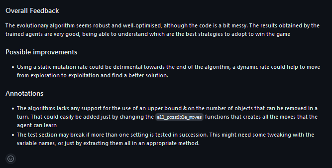
    <figcaption>pair review by Alessandro Chiabodo S309234</figcaption>
</figure>

Peer review given: 
<div>
<figure>

<figcaption>pair review to Beatrice Occhiena s314971</figcaption>
</figure>
<figure>
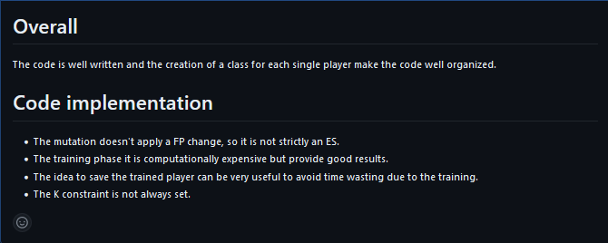
<figcaption>pair review to Alessandro Chiabodo S309234</figcaption>
</figure>
</div>


**Laboratory 9** 

Peer review received: 
<div>
<figure>
  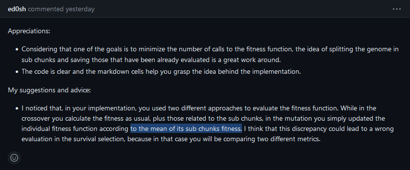
  <figcaption>pair review by Edoardo Franco s310228</figcaption>
</figure>
<figure>
  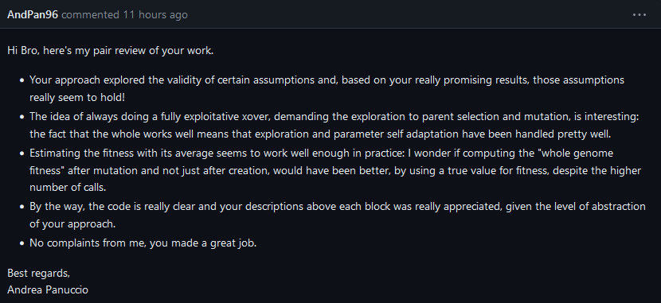
  <figcaption>pair review by Andrea Panuccio s294603</figcaption>
</figure>
<figure>
  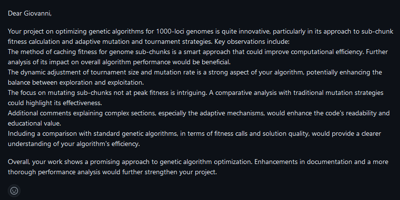
  <figcaption>pair review by Hossein Kakavand s313884</figcaption>
</figure>
<div>


Peer review given: 
<div>
<figure>
  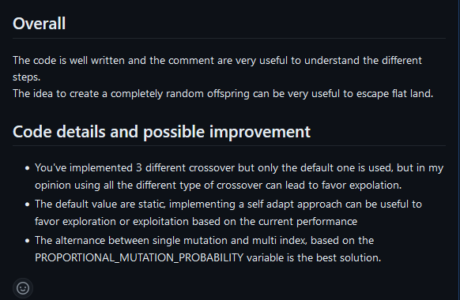
  <figcaption>pair review to Edoardo Franco s310228</figcaption>
</figure>

<figure>
  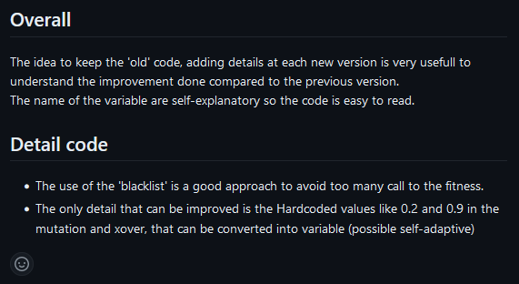
  <figcaption>pair review to Andrea Panuccio s294603</figcaption>
</figure>


</div>


**Laboratory 10** 

Peer review given: 
<div>
<figure>
  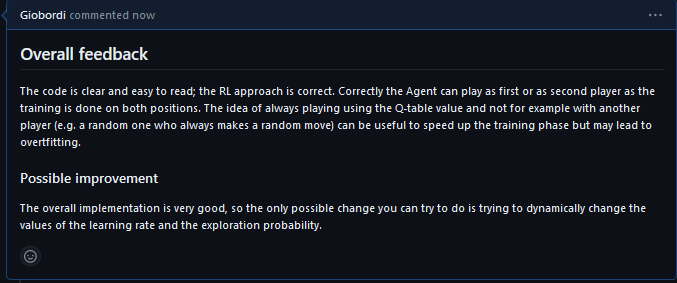
  <figcaption>pair review to Miriam Ivaldi s309062</figcaption>
</figure>

<figure>
  
  <figcaption>pair review to Luca Solaini s306033</figcaption>
</figure>

</div>

**Presentation 08/01/2024**
### Tic Tac Toe with reinforcement learning


<div style="display: flex;">
    <div style="flex: 50%; padding: 5px;">
        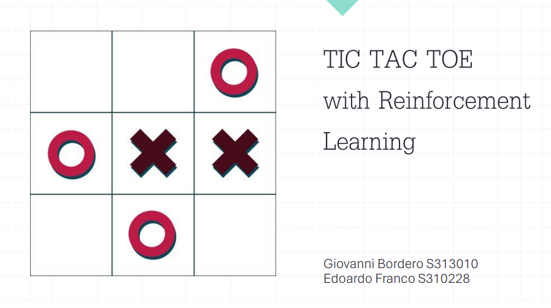
        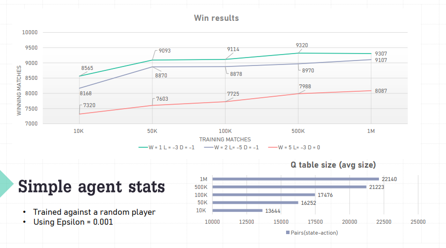
        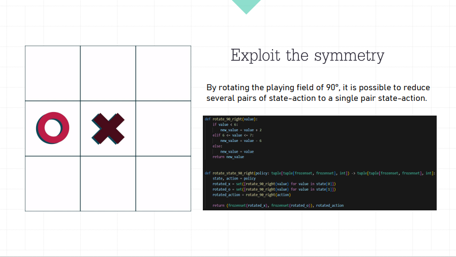
        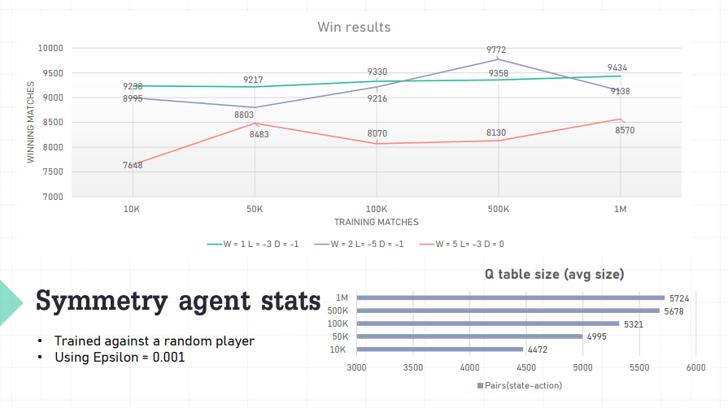
        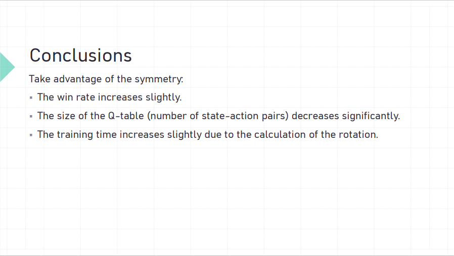
    </div>
    <div style="flex: 50%; padding: 5px;">
        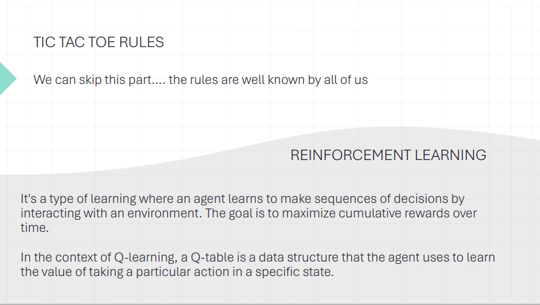
        
        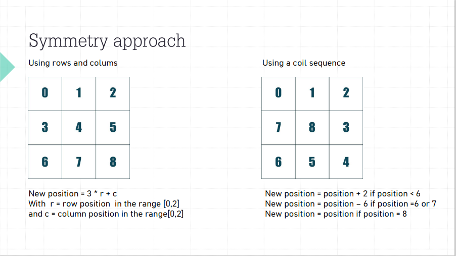
        
        
    </div>
</div>

The presentation is about the Tic Tac Toe games and the reinforcement learning algorithm used to train the agent. 
The main topic is the difference between a simple Agent (trained using a traditional Monte Carlo approach) and an agent that exploits the symmetry of the game board.