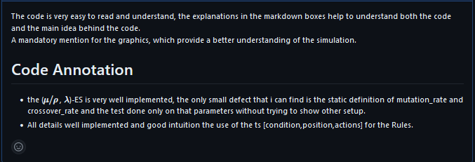
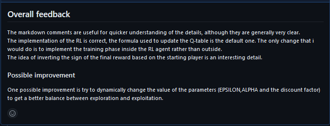
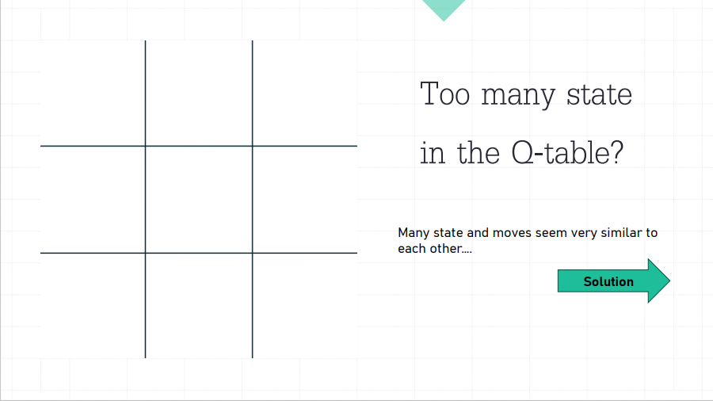

## Report Computational Intelligence 2023/2024
Giovanni Bordero s313010 

## Laboratory 1: Set cover problem using A* algorithm

Two heuristic functions have been used : 
- the first one, called `heuristic1`, is the number of elements that are not covered by any subset. This heuristic is not correct, it is not admissible because it can overestimate the cost of the solution.
```python
def heuristic1(state):
    return PROBLEM_SIZE - len(state.taken)
```
- the second one, called `heuristic2`, calculates the minimum number of subsets that are needed to cover all the elements. This heuristic is correct, it is admissible because it never overestimates the cost of the solution (but it can underestimate it).
```python
def heuristic2(state : State):
    already_covered = covered(state) 
    if np.all(already_covered):
        return 0
    not_already_covered = np.logical_not(already_covered)   
    max_val = max(sum(np.logical_and(SETS[i], not_already_covered)) for i in state.not_taken)
    #max_val is the maximum number of uncovered element covered by a single element in the not_taken group
    return ceil(sum(not_already_covered)/max_val) if max_val!= 0 else PROBLEM_SIZE
```
Two cost functions have been used :
- the first one, called `actual_cost`, is the number of subsets that have been taken. 
```python
def actual_cost(state): 
    return len(state.taken)
```
- the second one, called `actual_cost2`, is the sum of the number of subsets taken and the distance from the goal state (number of uncovered elements). 
```python
def actual_cost2(state : State) :  
  return len(state.taken) + distance_from_the_goal(state)
```
To verify the correctness of the algorithm, at the bottom of the file `A_star.ipynb` there is the breadth-first search algorithm, to check if the solution found by the A* algorithm is the optimal one.

## Halloween Challenge: 
I've implemented 4 different algorithms to solve the Halloween Challenge.The fitness function used for all the algorithms is called `covering_and_num_sets` and it returns the number covered elements and the number of sets used to evaluate a state.
- **Random Hill Climbing** : I've implemented two *tweaks* function `tweak_hill_climbing` and `tweak_hill_climbing_exploration`, the only difference is that the second one tweaks more elements of the state (it is more explorative). The stopping condition is the number of iterations equal to `ceil(num_points/2)`. 

- **Simulated Annealing** :  the *tweak* function is called `tweak_simulated_annealing` and the function `simulated_annealing` apply the main idea of this approach, accepting a worse state with a probability that decreases with the number of iterations (the temperature increase following the formula $temperature * (coolingRate^{iteration})$).The stopping condition is the number of iterations equal to `ceil(num_points/2)`.

- **Tabu search** : the *tweak* function is called `tweak_tabu_search` and each new state is added to a list of tabu states `tabu_list` updated at each iteration. The stopping condition is the number of iterations equal to `ceil(num_points/2)`.


- **Iterated Local Search** : the *tweak* function is called `tweak_iterated_local` and in the algorithm the condiction to apply the `new_starting_position` (that is the random restart when the algorithm is stuck in a local optimum)  is that for `ceil(set_threashold/10)` time the new state is not better than the previous one. Even in this case the stopping condition is the number of iterations equal to `ceil(num_points/2)`.

The best result obtained are shown in the following table:
<figure>
    
</figure>

These results have been shared also in the Telegram group before the deadline.


## Laboratory 2  : Nim game using EA 
The goal was to implement an Evolutionary Algorithm to play the game Nim.

- I've implemented two version of an ES, the first version using a *plus* strategy (function `evolutionary_strategies`) and at each iteration choosing between crossover and mutation; the a second version uses a *comma* strategy (function `evolutionary_strategies_comma`) and at each iteration choosing between crossover and mutation. For both strategies there are different mutation functions, `mutation(indiv: list, state :Nim)`, a individual is mutated by changing the number of elements to substract from the heap, `mutation2(indiv: list, state :Nim)` the number of element to subtract from the from the heap is equal to the max-1 .  The 'parent selection' is done using the function `tournament_selection(population : list, k :int, sorted_population : int)` and the 'crossover' is done using the function `crossover(ind_one : list, ind_two : list, state : Nim)` where the two parents are crossed by taking the row from the first individual and the elements to substract from the second individual (checking if it is valid,else try the opposite but even this operation is not possible return the first individual). The 'survivor selection' is done sorting the population by fitness and then selecting the best `population_size` individuals.

This apporach is based on the nim-sum as the fitness function , that it was not to be used. So I've implemented a new version of the ES.


- In the second version, the `class Rule` defines a possible rule (like the nim-sum) and has a weight that represent the importance of this rule, the default value is 0.5 and it is updated during the evaluation process. The ES agent is represented by the `class EsNimAgent` that has a list of rules, the number of games played and the number of games won. The move is selected based on the weight, if there are no possible moves the move is selected randomly. 

  Some important function for the initialization are:

    - `all_possible_moves()` : returns all the possible moves for a Nim game
    - `condition_for_rule()` : returns alla the possible condition for the rule class
    - `global_set_rules()` : associate all the conditions to all the possible moves
    - `create_population()` : creates a population of NimAgent with random rules

  ES main function : 
    - `mutation()` : change the rules inside an agent.
    - `one_cut_cross_over()` : it crosses two agents by taking the first part of the first agent and the second part of the second agent
    - `survival_selection()` : it selects the best agents based on the fitness
    - `tournament_selection()` : the best agent between a 'tournament_size' number of agents, the competition is based on the fitness
    - `generate_new_generation()` : it is the function that create a new generation (offspring) applying the mutation and the crossover and the tournament selection.
    - `ES()` : it is the function that start the ES, each agent do a number of games equal to the 'number_of_games' parameter with the 3 different opponents (optimal, pure_random and gabriele) and update the weights of the rule based on win/lose. The main approach is a 'plus' approach, the new generation is added to the old one and the best agents are selected, the number of new agents created is equal to the number of agents in the old generation. At the end of the entire process the agent with the best fitness is returned

At the end of the notebook there are different configurations of the ES, trying to tune the parameters to obtain the best result against the optimal agent that take advantage of the *nim-sum heuristic*. 

Peer reviews received: 
<figure>
    
    <figcaption>pair review by Alessandro Chiabodo S309234 on Nov 23, 2023</figcaption>
</figure>

Peer reviews given: 
<div>
<figure>

<figcaption>pair review to Beatrice Occhiena s314971 on Nov 23, 2023</figcaption>
</figure>
<figure>

<figcaption>pair review to Alessandro Chiabodo S309234 on Nov 23, 2023</figcaption>
</figure>
</div>


## Laboratory 9 : Problem instances 1,2,5,10 on a 1000-loci genome using EA

I developed a Genetic Algorithm to manage this problem. \
I decided to use a 'plus' strategy, so the offspring will be added to the population, the selection is made with a tournament selection approach and the size of the tournament is self-adapted based on the performance of the algorithm and even the mutation probability is self-adapted. The main idea is to evaluate the fitness on subchunks of the genome, saving the fitness value of each subchunk (avoiding to recompute it if it is already computed due the fact the fitness function is costly, the variable are `SUB_CHUNKS_SAVED` `SUB_FITNESS_SAVED`), trying to maximize the fitness of each subchunk (the dimension of the subchunk is equal to 2*instance). The crossover is made by taking the best subchunk between the two parents, this is done for each subchunk of the genome. \

Initial settings
```python 
POP_SIZE = 100  ## the population size is quite small because we are trying to minimize the number of fitness calls
OFFSPRING_SIZE =  20 
LOCI = 1000
MUTATION_RATE = 0.7  ## the mutation rate is quite high at the beginning because we want to explore the space
GENERATIONS = 1000
TOURNAMENT_SIZE = 30 ## the tournament size is quite big at the beginning because we want to select the best individual 
INCREASING_THRESHOLD = 0.01 ## the threshold to evaluate if the performance is increasing enough
MUTATION_MODIFIER = 0.03 ## the modifier to increase or decrease the mutation rate
TOURNAMENT_MODIFIER = 2 ## the modifier to increase or decrease the tournament size
ADAMPTABILITY = 10 ## the number of generations to evaluate the performance
MUTATION_DIVIDER = 100 
```

Function for self adaptation

```python 
def adaptive_tournament_size(adaptation : list[float], tournament_size : int) -> int : 
  #.....

def adaptive_mutation_rate(adaptation : list[float], mutation_rate : float) -> float : 
  #.....
```
Function for the evolution
```python 
def tournament_selection(population : list[Individual], tournament_size : int) -> list:
    tournament = choices(population, k=tournament_size)
    return max(tournament, key=lambda ind: ind.fitness)

def uniform_sub_chuncks_crossover(parent1 : Individual, parent2 : Individual) -> Individual:
    genome = []
    for i in range(len(parent1.sub_chunks)):
        if parent1.fitness_chunk[i] >= parent2.fitness_chunk[i]:
            genome += parent1.sub_chunks[i]
        else:
            genome += parent2.sub_chunks[i]
    return Individual(genome=genome,fit=fitness(genome),k=K)

def mutate_sub_chuncks(ind : Individual, mutation_rate : float):
    ind = deepcopy(ind)
    for i in range(len(ind.sub_chunks)):
        if ind.fitness_chunk[i] < 1.0:
            indice = randint(0, len(ind.sub_chunks[i]) - 1) 
            ind.sub_chunks[i][indice] = 1-ind.sub_chunks[i][indice]  ###flip one bit tryin to improve the fitness   
            ind.fitness_chunk[i] = ind.chunk_fitness_alredy_computed(i)
    ind.fitness = sum(ind.fitness_chunk) / len(ind.fitness_chunk)
    return ind
```
Peer reviews received: 
<div>
<figure>
  
  <figcaption>pair review by Edoardo Franco s310228 on Dec 8, 2023</figcaption>
</figure>
<figure>
  
  <figcaption>pair review by Andrea Panuccio s294603 on Dec 10, 2023</figcaption>
</figure>
<figure>
  
  <figcaption>pair review by Hossein Kakavand s313884 on Dec 10, 2023</figcaption>
</figure>
<div>


Peer reviews given: 
<div>
<figure>
  
  <figcaption>pair review to Edoardo Franco s310228 on Dec 10, 2023</figcaption>
</figure>

<figure>
  
  <figcaption>pair review to Andrea Panuccio s294603 on Dec 10, 2023</figcaption>
</figure>


</div>


**Laboratory 10** 

Peer reviews given: 
<div>
<figure>
  
  <figcaption>pair review to Miriam Ivaldi s309062 on 5 Gen, 2024</figcaption>
</figure>

<figure>
  
  <figcaption>pair review to Luca Solaini s306033 on 5 Gen, 2024</figcaption>
</figure>

</div>

**Presentation 08/01/2024**
### Tic Tac Toe with reinforcement learning


<div style="display: flex;">
    <div style="flex: 50%; padding: 5px;">
        
        
        
        
        
    </div>
    <div style="flex: 50%; padding: 5px;">
        
        
        
        
        
    </div>
</div>

The presentation is about the Tic Tac Toe games and the reinforcement learning algorithm used to train the agent. 
The main topic is the difference between a simple Agent (trained using a traditional Monte Carlo approach) and an agent that exploits the symmetry of the game board.